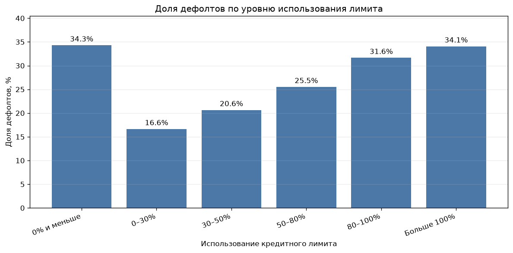
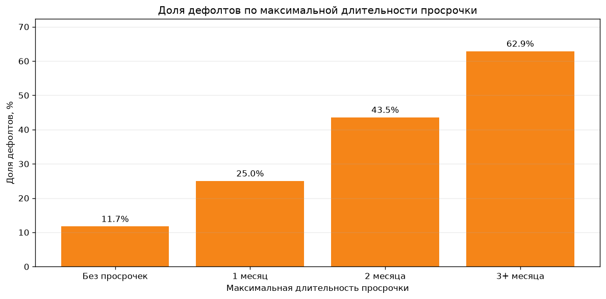
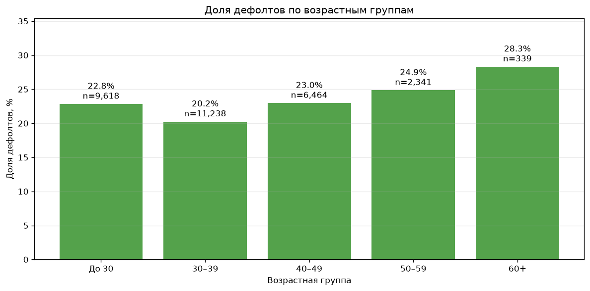
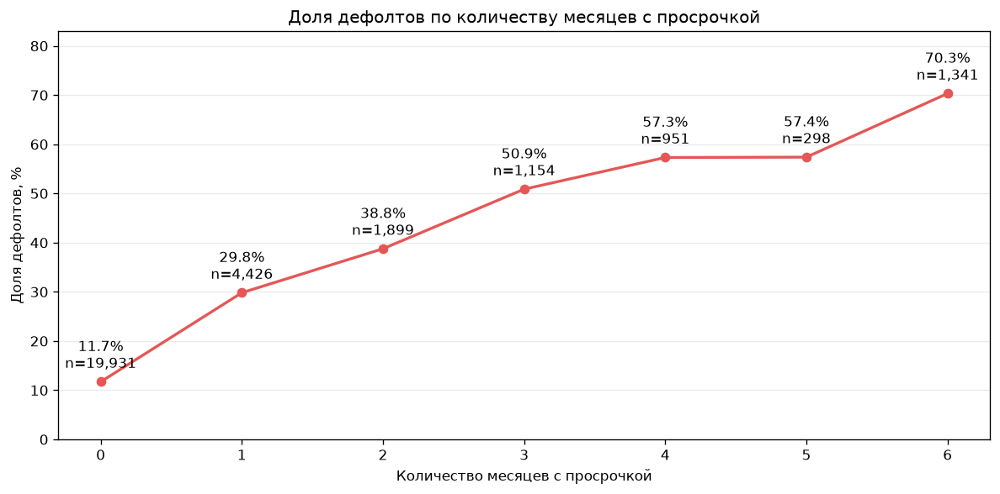

# Smart Default

Pet-проект по анализу факторов дефолта клиентов кредитных карт. Я подготовил данные в PostgreSQL, собрал аналитическую витрину и провёл исследовательский анализ в Python.

Цель проекта — понять, какие характеристики клиента и его платёжного поведения связаны с дефолтом в следующем месяце.

## Данные

В проекте используется датасет [Default of Credit Card Clients](https://archive.ics.uci.edu/dataset/350/default%2Bof%2Bcredit%2Bcard%2Bclients) из UCI Machine Learning Repository.

- 30 000 клиентов;
- кредитный лимит и демографические признаки;
- история счетов и платежей за шесть месяцев;
- статусы просрочки;
- целевая переменная `default_next_month`.

Источник: Yeh, I. (2009), UCI Machine Learning Repository, DOI: [10.24432/C55S3H](https://doi.org/10.24432/C55S3H). Лицензия датасета — CC BY 4.0.

## Инструменты

- PostgreSQL и SQL — проверка, очистка и подготовка витрины;
- Python и Pandas — исследовательский анализ;
- Matplotlib — визуализация;
- Jupyter Notebook — оформление расчётов и выводов.

## Как построен проект

Сначала исходные данные загружаются в PostgreSQL. SQL-скрипт проверяет качество данных, приводит категории к понятному виду и создаёт представление `credit_features`. Затем это представление загружается в Python для анализа.

```text
Исходный CSV → PostgreSQL → credit_features → Python EDA → выводы
```

## Основные результаты

Дефолт наблюдается у 6 636 клиентов, или у 22,12% выборки.

Самая сильная связь обнаружена у просрочек. Доля дефолтов увеличивается с 11,71% среди клиентов без просрочек до 62,87% при максимальной просрочке три месяца и больше. Среди клиентов с просрочками во всех шести наблюдаемых месяцах показатель достигает 70,32%.

Использование кредитного лимита тоже связано с дефолтом. Среди клиентов с положительной утилизацией показатель растёт с 16,64% при использовании до 30% лимита до 34,07% при использовании более 100%.

Возраст разделяет клиентов слабее и не показывает строгой линейной зависимости. Минимальная доля дефолтов наблюдается в группе 30–39 лет — 20,25%, максимальная в группе 60+ — 28,32%. В старшей группе только 339 клиентов, поэтому результат нужно трактовать осторожно.

Изменение задолженности не показало ожидаемой зависимости. У клиентов с растущей задолженностью доля дефолтов оказалась ниже, чем в остальных группах. Дополнительная проверка показала, что группы различаются по прошлым просрочкам, поэтому `bill_change_amt` нельзя использовать как самостоятельный показатель риска.

## Графики

### Использование лимита



### Максимальная длительность просрочки



### Возрастные группы



### Частота просрочек



## Вывод и рекомендации

Основными сигналами повышенного риска оказались длительность и частота просрочек. Среди клиентов без просрочек доля дефолтов составляет 11,71%, при просрочке два месяца — 43,55%, а при просрочке три месяца и более — 62,87%. Поэтому клиентов с просрочкой более одного месяца стоит относить к группе повышенного внимания.

Дополнительным сигналом является высокая утилизация кредитного лимита. При использовании 80–100% лимита доля дефолтов составляет 31,65%, а при превышении лимита — 34,07%. Таких клиентов также стоит включать в группу повышенного риска, особенно если высокая утилизация сопровождается просрочками.

Частота просрочек подтверждает эту зависимость: чем больше месяцев клиент допускал просрочку, тем выше доля дефолтов в следующем месяце. У клиентов с просрочками во всех шести наблюдаемых месяцах она достигает 70,32%.

Возраст оказался значительно менее сильным фактором. Группа 30–39 лет показывает минимальную долю дефолтов, но разница недостаточна для отдельной бизнес-рекомендации. Возраст лучше рассматривать только вместе с платёжным поведением клиента.

Изменение задолженности и отношение платежей к счёту также не стоит использовать как самостоятельные основания для решения. Показатель `payment_to_bill_pct` требует дополнительной обработки выбросов: его медиана равна 9,37%, а максимум достигает 79 700% из-за очень маленьких положительных счетов.

Таким образом, для раннего выявления повышенного кредитного риска в первую очередь следует отслеживать длительность и количество просрочек, а высокую утилизацию лимита использовать как дополнительный сигнал.

Это исследовательский анализ. Перед применением результатов в кредитной политике выводы необходимо проверить на новых данных.

## Структура

```text
credit-default-analysis/
├── data/raw/UCI_Credit_Card.csv
├── figures/
├── notebooks/01_eda.ipynb
├── sql/credit_default_analysis.sql
├── .env.example
├── .gitignore
├── requirements.txt
└── README.md
```

## Запуск

1. Создать базу PostgreSQL и загрузить CSV в таблицу `uci_credit_card`.
2. Выполнить `sql/credit_default_analysis.sql`.
3. Скопировать `.env.example` в `.env` и заполнить параметры подключения.
4. Установить зависимости:

```bash
pip install -r requirements.txt
```

5. Открыть `notebooks/01_eda.ipynb` и выполнить ячейки сверху вниз.
